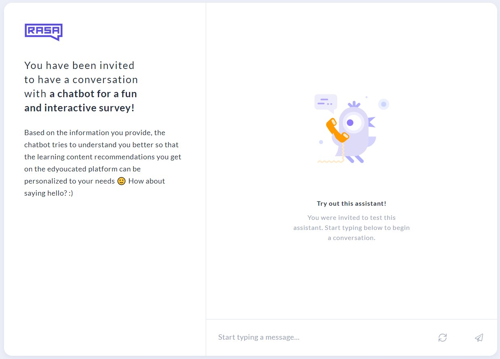

<!-- https://github.com/othneildrew/Best-README-Template -->
<a name="readme-top"></a>
<!-- PROJECT SHIELDS -->
<!--
*** I'm using markdown "reference style" links for readability.
*** Reference links are enclosed in brackets [ ] instead of parentheses ( ).
*** See the bottom of this document for the declaration of the reference variables
*** for contributors-url, forks-url, etc. This is an optional, concise syntax you may use.
*** https://www.markdownguide.org/basic-syntax/#reference-style-links
-->

[![MIT License][license-shield]][license-url]


<!-- TABLE OF CONTENTS -->
<details>
  <summary>Table of Contents</summary>
  <ol>
    <li>
      <a href="#about-the-project">About The Project</a>
      <ul>
        <li><a href="#built-with">Built With</a></li>
      </ul>
    </li>
    <li>
      <a href="#getting-started">Getting Started</a>
      <ul>
        <li><a href="#prerequisites">Prerequisites</a></li>
        <li><a href="#installation">Installation</a></li>
      </ul>
    </li>
    <li><a href="#usage">Usage</a></li>
    <li><a href="#roadmap">Roadmap</a></li>
    <li><a href="#contributing">Contributing</a></li>
    <li><a href="#license">License</a></li>
    <li><a href="#contact">Contact</a></li>
    <li><a href="#acknowledgments">Acknowledgments</a></li>
  </ol>
</details>


<!-- ABOUT THE PROJECT -->
## About The Project

This is the GitHub repository for the _survey chatbot prototype_ that was built in the context of the master thesis titled ''_Collecting personal learner information in digital education: 
From tedious questionnaire to entertaining chatbot experience_'', written by Maximilian Kania at the University of Muenster.

In the thesis, it was aimed to build a _fun and interactive chatbot survey_ to elicit high-quality from information from users on a learning platform, while providing a good user experience. Thereby, the survey chatbot approach is supposed to substitute a boring, regular web survey.

Overall, the primary tool that was used to build the chatbot is [Rasa](https://rasa.com/) but other technologies were employed as well (see below).

<div align="center">
  
</div>
<!--[![Product Name Screen Shot][product-screenshot]](https://example.com) -->


<p align="right">(<a href="#readme-top">back to top</a>)</p>


### Built and Deployed With

 - Rasa: [Rasa Docs](https://rasa.com/docs/rasa/)
 - Rasa X | Rasa Enterprise: [Rasa X Installation Guide](https://rasa.com/docs/rasa-enterprise/installation-and-setup/install/helm-chart-installation/installation)

<p align="right">(<a href="#readme-top">back to top</a>)</p>

### Enhanced With

The survey chatbot was enhanced with certain capabilities (see thesis for more details) by drawing on the following tools/servies:
* [Skills from Lightcast](https://skills.lightcast.io/)
* [Rapid fuzzy string matching](https://github.com/maxbachmann/RapidFuzz)
* [GPT-3 text generation and summarization](https://openai.com/api/)


<!-- GETTING STARTED -->
## Getting Started

To get a local copy of the _survey chatbot prototype_ up and running follow these steps:

### Installation & Deployment

_Below you can find instructions on installing and setting up the prototype locally (communicate with the chatbot via the CLI)._

1. Get an account and API Key at [https://openai.com/](https://openai.com/) to be able to use _GPT-3_ (you start with a good amount of free credits that last three months).
2. Clone this repository.
   ```sh
   git clone https://github.com/Maximilian-Ka/survey-chatbot-prototype.git
   ```
3. Create and activate a virtual Python environment.
4. Install the required packages (this might take a while): 
    ```sh
    pip install -r requirements.txt
    ```
5. Additionally, install rasa and spaCy:
    ```sh
    pip3 install rasa==3.1.2
    ```
    ```sh
    pip install -U spacy
    ```
    ```sh
    python -m spacy download en_core_web_md
    ```
6. Enter your OpenAI API key in `actions/NLG/.env`
    ```py
    OPENAI_API_KEY=<your_API_key>
    ```
7. Train the chatbot model
    ```sh
    rasa train --augmentation 0
    ```
8. Run the survey chatbot in the CLI.
    ```sh
    rasa shell
    ```
9. and don't forget to run the action server in a separate terminal.
    ```sh
    rasa run actions
    ```

Note, that you can find further information on what you can do with the Rasa chatbot in the CLI in this [Cheat Sheet](https://rasa.com/docs/rasa/command-line-interface/).

***

DEPLOYMENT

To let test users talk to the survey chatbot, you need to deploy it. One way to deploy a Rasa chatbot is via the tool _Rasa X_. However, the deployment can get tricky.

Here's further information on how you might deploy the chatbot with Rasa X:

_----Coming soon -----_

<p align="right">(<a href="#readme-top">back to top</a>)</p>


<!-- USAGE EXAMPLES -->
<!--## Usage -->

<!--Use this space to show useful examples of how a project can be used. Additional screenshots, code examples and demos work well in this space. You may also link to more resources.

_For more examples, please refer to the [Documentation](https://example.com)_

<p align="right">(<a href="#readme-top">back to top</a>)</p> -->


<!-- ROADMAP -->


<!-- CONTRIBUTING -->
<!--## Contributing -->


<!--<p align="right">(<a href="#readme-top">back to top</a>)</p> -->


<!-- LICENSE -->
## License

Distributed under the MIT License. See `LICENSE.txt` for more information.

**Notice**:

The presented survey chatbot draws on the _GPT-3_ API and the _Lightcast_ skills library, which are third-party services or products that impose terms of use that have to be abided by.
Have a look at the following links before adapting the survey chatbot and putting it to use for your use case:

* [Lightcast's terms of use](https://skills.lightcast.io/lightcast-open-skills-license-agreement.pdf)
* [OpenAI's usage guide](https://beta.openai.com/docs/usage-guidelines)

<p align="right">(<a href="#readme-top">back to top</a>)</p>


<!-- CONTACT -->
## Contact

<!-- Your Name - [@your_twitter](https://twitter.com/your_username) - email@example.com -->

Project Link: [https://github.com/Maximilian-Ka/survey-chatbot-prototype](https://github.com/Maximilian-Ka/survey-chatbot-prototype)

<p align="right">(<a href="#readme-top">back to top</a>)</p>


<!-- ACKNOWLEDGMENTS -->
## Acknowledgments

At this point it shall again be given attribution to [Lightcast](https://skills.lightcast.io/) because the _skill_extraction_, which is one of the survey chatbot's capabilities, makes use of their dataset (see _actions/data/_ folder). Note, that the portion of the dataset used for this project has been changed by adding an addition column _emsi_skill_title_normalized_.
<!-- Use this space to list resources you find helpful and would like to give credit to. I've included a few of my favorites to kick things off! -->


<p align="right">(<a href="#readme-top">back to top</a>)</p>


<!-- MARKDOWN LINKS & IMAGES -->
<!-- https://www.markdownguide.org/basic-syntax/#reference-style-links -->

[license-shield]: https://img.shields.io/github/license/othneildrew/Best-README-Template.svg?style=for-the-badge
[license-url]: https://github.com/othneildrew/Best-README-Template/blob/master/LICENSE.txt